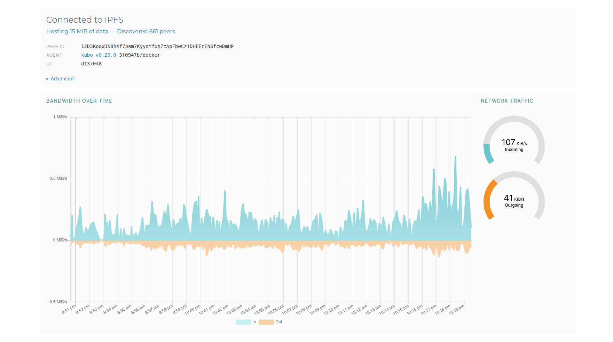

# Lab 2: DevOps Tool Exploration
## Task 1: Set Up an IPFS Gateway Using Docker

|  |  |
|--|--|
|peer id:|12D3KooWJN8hXf7pam7KyyoYfuX7zApFbwCz1DHEErEN6fcwDmUP|
|hash:| QmQ1g8k2f4GuiA6zGwkxG9zfmAQ6D8L2B4T9evDYY38Ckr |
|url file:| [url](https://ipfs.io/ipfs/QmQ1g8k2f4GuiA6zGwkxG9zfmAQ6D8L2B4T9evDYY38Ckr?filename=URtwerk.gif) |

## Task 2: Set Up Project on Fleek.co
|  |  |
|--|--|
|ipfs hash:| bafybeihgxb6dvjyg3lramby6yrksoxg5qycyg5p6issvitelbez7wdrngu |
|domain:| [domain]https://nazarov-artem-ur-twerk.on-fleek.app |
