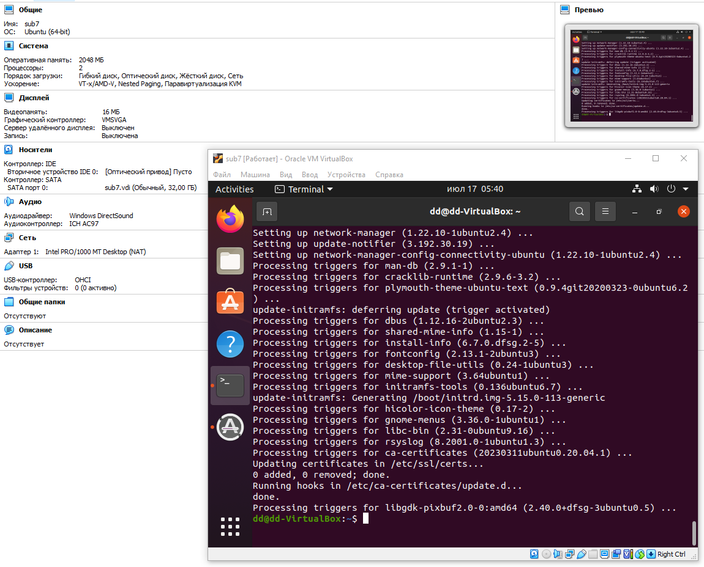

# **Lab 7: Virtualization Lab**
---
## **Task 1: VM Deployment**
* **VirtualBox version**: Windows 6.1.50 r161033
in the latest version of VirtualBox(7.0.18), I couldn't launch the terminal. So I installed VirtualBox(6.1.50).
1. Downloaded ***ubuntu-20.04.6-desktop-amd64.iso*** from the official website
2. Named the virtual machine (sub7) and selected the operating system type (Linux/Ubuntu(64-bit))
3. Specified the required volume of RAM (2Gb)
4. Created a 32 Gb VDI (dynamic)
5. In the settings changed the number of CPU threads used from 1 to 2
6. Installed Ubuntu 20.04 from the image
*  Running VM with configurations.


## **Task 2: System Information Tools**
1. ***CPU***
    ```
    lscpu
    ```
    ```
    Architecture: x86_64
    CPU op-mode(s): 32-bit, 64-bit
    Byte Order: Little Endian
    Address sizes: 39 bits physical, 48 bits virtual
    CPU(s): 2
    On-line CPU(s) list: 0,1
    Thread(s) per core: 1
    Core(s) per socket: 2
    Socket(s): 1
    NUMA node(s): 1
    Vendor ID: GenuineIntel
    CPU family: 6
    Model: 165
    Model name: Intel(R) Core(TM) i3-10105F CPU @ 3.70GHz
    Stepping: 3
    CPU MHz: 3696.000
    BogoMIPS: 7392.00
    Hypervisor vendor: KVM
    Virtualization type: full
    L1d cache: 64 KiB
    L1i cache: 64 KiB
    L2 cache: 512 KiB
    L3 cache: 12 MiB
    ```
2. ***RAM***
    ```
    free -m
    ```
    ```
    total used free shared buff/cache available
    Mem:  1963 1217 188    16   557   565
    Swap: 1497 305  1191
    ```
    ```
    sudo lshw -c memory
    ```
    ```
    *-firmware
        description: BIOS
        vendor: innotek GmbH
        physical id: 0
        version: VirtualBox
        date: 12/01/2006
        size: 128KiB
        capacity: 128KiB
        capabilities: isa pci cdboot bootselect int9keyboard int10video acpi
    *-memory
        description: System memory
        physical id: 1
        size: 2GiB
    ```
3. ***Network***
    ```
    sudo apt install net-tools
    ifconfig
    ```
    ```
    enp0s3: flags=4163<UP,BROADCAST,RUNNING,MULTICAST> mtu 1500
            inet 10.0.2.15 netmask 255.255.255.0 broadcast 10.0.2.255
            inet6 fe80::3789:c78:32d5:3c48 prefixlen 64 scopeid 0x20<link>
            ether 08:00:27:c4:86:ff txqueuelen 1000 (Ethernet)
            RX packets 44147 bytes 52473261 (52.4 MB)
            RX errors 0 dropped 0 overruns 0 frame 0
            TX packets 15657 bytes 2427796 (2.4 MB)
            TX errors 0 dropped 0 overruns 0 carrier 0 collisions 0
    
    lo: flags=73<UP,LOOPBACK,RUNNING> mtu 65536
        inet 127.0.0.1 netmask 255.0.0.0
        inet6 ::1 prefixlen 128 scopeid 0x10<host>
        loop txqueuelen 1000 (Local Loopback)
        RX packets 1919 bytes 172505 (172.5 KB)
        RX errors 0 dropped 0 overruns 0 frame 0
        TX packets 1919 bytes 172505 (172.5 KB)
        TX errors 0 dropped 0 overruns 0 carrier 0 collisions 0
    ```
4. ***OS***
    ```
    cat /etc/os-release
    ```
    ```
    NAME="Ubuntu"
    VERSION="20.04.6 LTS (Focal Fossa)"
    ID=ubuntu
    ID_LIKE=debian
    PRETTY_NAME="Ubuntu 20.04.6 LTS"
    VERSION_ID="20.04"
    HOME_URL="https://www.ubuntu.com/";
    SUPPORT_URL="https://help.ubuntu.com/";
    BUG_REPORT_URL="https://bugs.launchpad.net/ubuntu/";
    PRIVACY_POLICY_URL="https://www.ubuntu.com/legal/terms-and-policies/privacy-policy";
    VERSION_CODENAME=focal
    UBUNTU_CODENAME=focal
    ```
