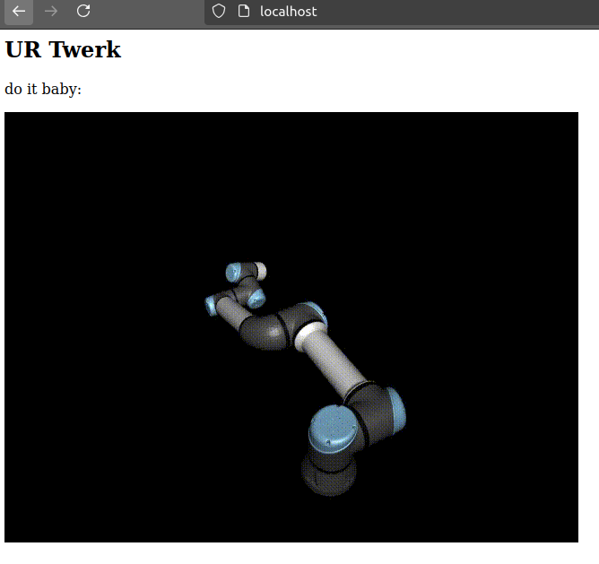

# **Lab 8: Containers Lab - Docker**
---
## **Task 1: Container Management**

1. **List Containers**:
    ```
    sudo docker ps -a
    ```
    ```
    CONTAINER ID   IMAGE         COMMAND    CREATED       STATUS                   PORTS     NAMES
    b3fa09238e2b   hello-world   "/hello"   2 weeks ago   Exited (0) 2 weeks ago             loving_black

    ```

2. **Pull Latest Ubuntu Image**:
    ```
    sudo docker pull ubuntu:latest
    ```
    ```
    latest: Pulling from library/ubuntu
    4a57852c9ec1: Pull complete 
    Digest: sha256:2e863c44b718727c860746568e1d54afd13b2fa71b160f5cd9058fc436217b30
    Status: Downloaded newer image for ubuntu:latest
    docker.io/library/ubuntu:latest
    ```

3. **Run Container**:
    ```
    sudo docker run -it --name ubuntu_container ubuntu:latest
    ```
    ```
    root@4a57852c9ec1:/# cat /etc/os-release
    PRETTY_NAME="Ubuntu 24.04 LTS"
    NAME="Ubuntu"
    VERSION_ID="24.04"
    VERSION="24.04 LTS (Noble Numbat)"
    VERSION_CODENAME=noble
    ID=ubuntu
    ID_LIKE=debian
    HOME_URL="https://www.ubuntu.com/"
    SUPPORT_URL="https://help.ubuntu.com/"
    BUG_REPORT_URL="https://bugs.launchpad.net/ubuntu/"
    PRIVACY_POLICY_URL="https://www.ubuntu.com/legal/terms-and-policies/privacy-policy"
    UBUNTU_CODENAME=noble
    LOGO=ubuntu-logo
    root@4a57852c9ec1:/# 
    ```
    ```
    sudo docker ps -a
    ```
    ```
    CONTAINER ID   IMAGE           COMMAND       CREATED          STATUS                   PORTS     NAMES
    4a57852c9ec1   ubuntu:latest   "/bin/bash"   11 seconds ago   Up 9 seconds                       ubuntu_container
    b3fa09238e2b   hello-world     "/hello"      2 weeks ago      Exited (0) 2 weeks ago             loving_black
    ```
4. **Remove Image**:
    ```
    sudo docker rm -f 4a57852c9ec1
    ```
    ```
    4a57852c9ec1
    ```
    ```
    sudo docker ps -a
    ```
    ```
    CONTAINER ID   IMAGE           COMMAND       CREATED          STATUS                   PORTS     NAMES
    b3fa09238e2b   hello-world     "/hello"      2 weeks ago      Exited (0) 2 weeks ago             loving_black
    ```
## **Task 2: Image and Container Operations**
1. **Create Image Archive**:
    ```
    docker save -o ubuntu_image.tar ubuntu:latest
    ```
    sizes:
    - ubuntu image: 78.1 MB
    - ubuntu_image.tar: 80.6 MB

2. **Run Nginx Container**:
    ```
    sudo docker run -d -p 80:80 --name nginx_container nginx
    ```
    ```
    Unable to find image 'nginx:latest' locally
    latest: Pulling from library/nginx
    f11c1adaa26e: Pull complete 
    c6b156574604: Pull complete 
    ea5d7144c337: Pull complete 
    1bbcb9df2c93: Pull complete 
    537a6cfe3404: Pull complete 
    767bff2cc03e: Pull complete 
    adc73cb74f25: Pull complete 
    Digest: sha256:67682bda769fae1ccf5183192b8daf37b64cae99c6c3302650f6f8bf5f0f95df
    Status: Downloaded newer image for nginx:latest
    8a9e0f5ba757078897419f858cc587f7eac190693a743829725686c88ee107b3
    ```
    localhost: Welcome to nginx!

3. **Create HTML File**:
    ```
    sudo docker cp index.html nginx_container:/usr/share/nginx/html/index.html
    sudo docker cp URtwerk.gif nginx_container:/usr/share/nginx/html/URtwerk.gif
    ```
    ```
    Successfully copied 2.05kB to nginx_container:/usr/share/nginx/html/index.html
    Successfully copied 2.3MB to nginx_container:/usr/share/nginx/html/URtwerk.gif
    ```

4. **Create Custom Image**:
    ```
    sudo docker commit nginx_container my_website:latest
    ```
    ```
    sha256:1ce520386211484b804a97a76f8771a42e2d8888c8157a68c0e3faa241e21810
    ```


5. **Remove Original Container**:

    ```
    sudo docker rm -f nginx_container
    ```
    ```
    nginx_container
    ```

6. **Create New Container**:

    ```
    sudo docker run -d -p 80:80 --name my_website_container my_website:latest
    ```

    ```
    16260f6ab0cc1dae809a12991d4aa10cdb0fe124fe195f2c0411fcceb398659b
    ```
    
7. **Test Web Server**:

    

8. **Analyze Image Changes**:
    ```
    sudo docker diff my_website_container
    ```

    ```
    C /run
    C /run/nginx.pid
    C /etc
    C /etc/nginx
    C /etc/nginx/conf.d
    C /etc/nginx/conf.d/default.conf
    ```
    changed files and directories
