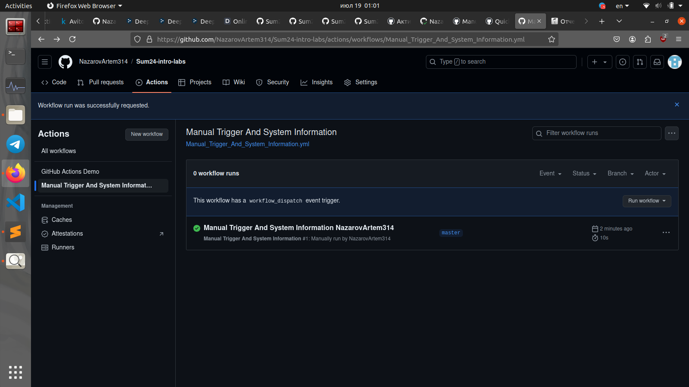

# **Lab 10: CI/CD Lab - GitHub Actions**
---
## **Task 1: Create Your First GitHub Actions Pipeline**
1. In repository on GitHub.com, create a workflow file called ```github-actions-demo.yml``` in the ```.github/workflows``` directory on repository, with contents:
    ```
    name: GitHub Actions Demo
    run-name: ${{ github.actor }} is testing out GitHub Actions 🚀
    on: [push]
    jobs:
      Explore-GitHub-Actions:
        runs-on: ubuntu-latest
        steps:
          - run: echo "🎉 The job was automatically triggered by a ${{ github.event_name }} event."
          - run: echo "🐧 This job is now running on a ${{ runner.os }} server hosted by GitHub!"
          - run: echo "🔎 The name of your branch is ${{ github.ref }} and your repository is ${{ github.repository }}."
          - name: Check out repository code
            uses: actions/checkout@v4
          - run: echo "💡 The ${{ github.repository }} repository has been cloned to the runner."
          - run: echo "🖥️ The workflow is now ready to test your code on the runner."
          - name: List files in the repository
            run: |
              ls ${{ github.workspace }}
          - run: echo "🍏 This job's status is ${{ job.status }}."
    ```

2. Commit changes on new branch 
3. Each new push to the github repository will create a new run.


## **Task 2: Gathering System Information and Manual Triggering**

1. In repository on GitHub.com, create a workflow file called ```Manual_Trigger_And_System_Information.yml ``` in the ```.github/workflows``` directory on repository, with contents:
    ```
    name: Manual Trigger And System Information
    run-name: Manual Trigger And System Information ${{ github.actor }} 
    on:
      workflow_dispatch:
    
    jobs:
      Explore-GitHub-Actions:
        runs-on: ubuntu-latest
        steps:
    
          - run: echo "Hardware"
          - run: lscpu
    
          - run: echo "Operating System"
          - run: cat /etc/os-release
    ```

2. Commit changes on main branch 
3. Runs now have to be started manually.



